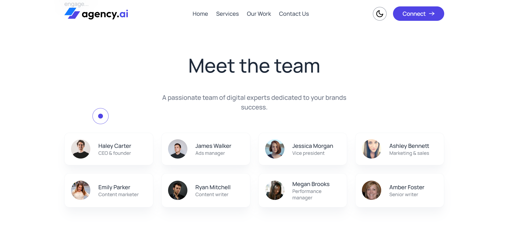

# React Agency Pro  

**React Agency Pro** is a modern, responsive, and visually appealing **digital agency website** built using **React**, **Tailwind CSS**, and **Framer Motion**.  

This project is designed to showcase a clean and professional agency layout with smooth animations, dark mode, custom cursor, and mobile-friendly responsiveness, ideal for agencies, freelancers, and creative portfolios.  

Built with **Vite** for lightning-fast performance and **Framer Motion** for elegant transitions, it delivers a seamless and dynamic user experience.

---

## Live Demo

Website: **[View Live Webiste](https://react-agency-pro.vercel.app)**

---

## Tech Badges  
  
  
  


---

## Project Preview 





---

## Features

-  **Blazing Fast** – Built with modern React + Vite for high performance
- **Beautiful UI** – Elegant design styled with Tailwind CSS
- **Smooth Animations** – Framer Motion brings pages to life
- **Fully Responsive** – Looks great on mobile, tablet, and desktop
- **Dark Mode** – Toggle theme instantly
- **Custom Cursor** – Enhances the interactive experience
- **Modern Design** – Perfect for digital agencies and portfolios
- **Easy Customization** – Clean and modular code structure

---

## Tech Stack

| Category           | Technology                                     |
| ------------------ | ---------------------------------------------- |
| **Frontend Framework** | React 18                                       |
| **Build Tool**         | Vite                                           |
| **Styling**            | Tailwind CSS + Custom CSS                      |
| **Animations**         | Framer Motion                                  |
| **Fonts**              | Google Fonts (Manrope, Outfit, Poppins, Prata) |
| **Icons**              | Lucide React                                   |

---

## Installation & Setup

### **Prerequisites**
- Node.js 16+
- npm or yarn

### **Steps**
```bash
# Clone the repository
git clone https://github.com/ARQUM21/react-agency-pro.git

# Navigate to project directory
cd react-agency-pro

# Install dependencies
npm install

# Start development server
npm run dev

```

## Project Structure

```text
react-agency-pro/
├── public/
│   └── favicon.ico
├── src/
│   ├── components/
│   │   ├── Navbar.jsx
│   │   ├── Hero.jsx
│   │   ├── OurWork.jsx
│   │   ├── ServicesCard.jsx
│   │   ├── Services.jsx
│   │   ├── Teams.jsx
│   │   ├── Title.jsx
│   │   ├── ThemeToggleBtn.jsx
│   │   ├── TrustedBy.jsx
│   │   ├── Contact.jsx
│   │   └── Footer.jsx
│   ├── App.jsx
│   ├── main.jsx
│   └── index.css
├── package.json
├── vite.config.js
└── README.md
```

## Custom Styling
 - All custom styles are in index.css:

```css
@import url('https://fonts.googleapis.com/css2?family=Manrope:wght@200..800&display=swap');
@import "tailwindcss";

* {
  font-family: "Manrope", sans-serif;
  font-weight: 500;
  cursor: none;
}

@theme {
  --color-primary: #5044E5;
}
```

## Custom Cursor
 - This project includes a custom cursor for a modern and engaging browsing experience, providing smooth hover and transition effects.

## Contributing
 1. Fork the project
 2. Create your feature branch:  ``` git checkout -b feature/AmazingFeature ```
 3. Commit your changes ```git commit -m 'Add some AmazingFeature'```
 4. Push to the branch ```git push origin feature/AmazingFeature```
 5. Open a Pull Request

## Author
 
  **Muhammad Arqum**

 ## Acknowledgments  

## Acknowledgements  

- [React Documentation](https://react.dev/)  
- [Tailwind CSS Documentation](https://tailwindcss.com/docs)  
- [Framer Motion Documentation](https://www.framer.com/motion/)  
- [Lucide Icons](https://lucide.dev/)  
- [Google Fonts](https://fonts.google.com/)  


 
⭐ If you found this project helpful or inspiring, please consider giving it a star, it really motivates me to create more.


